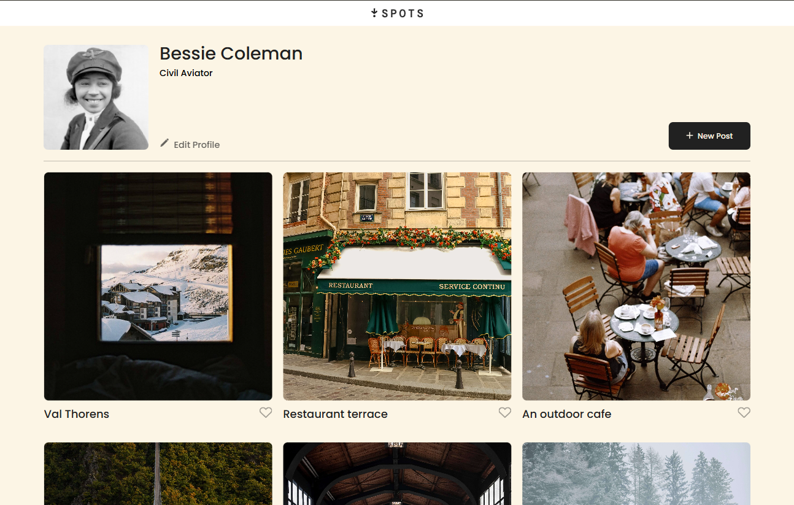
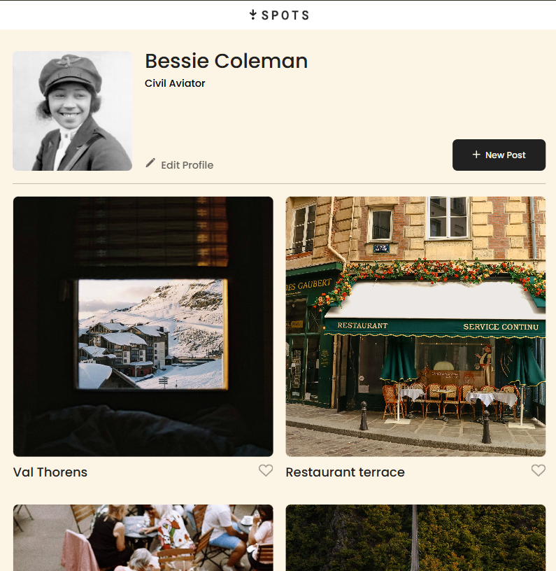
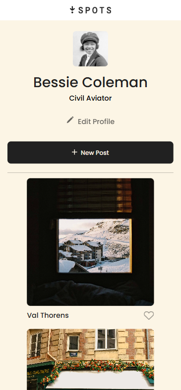
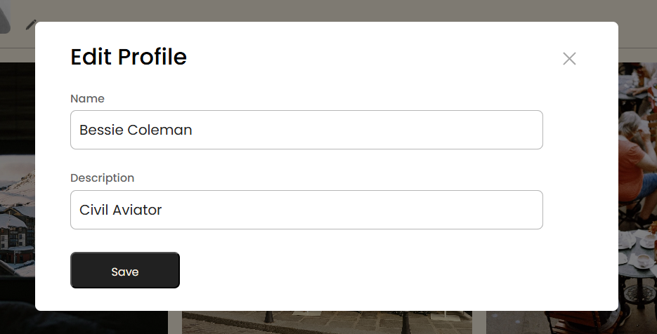
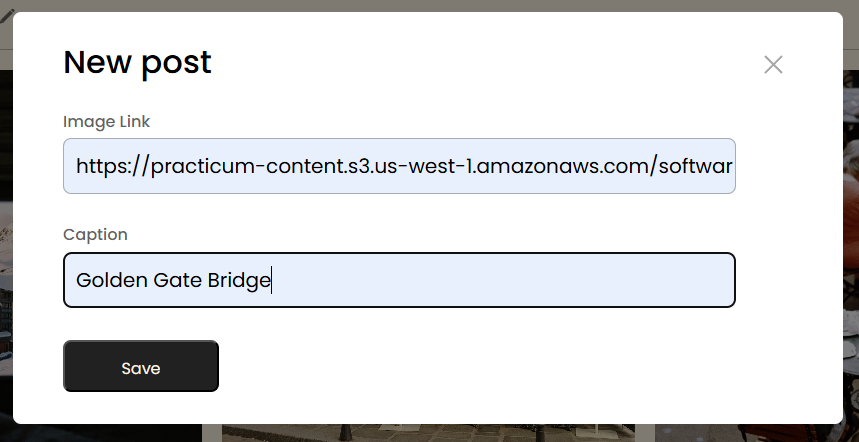
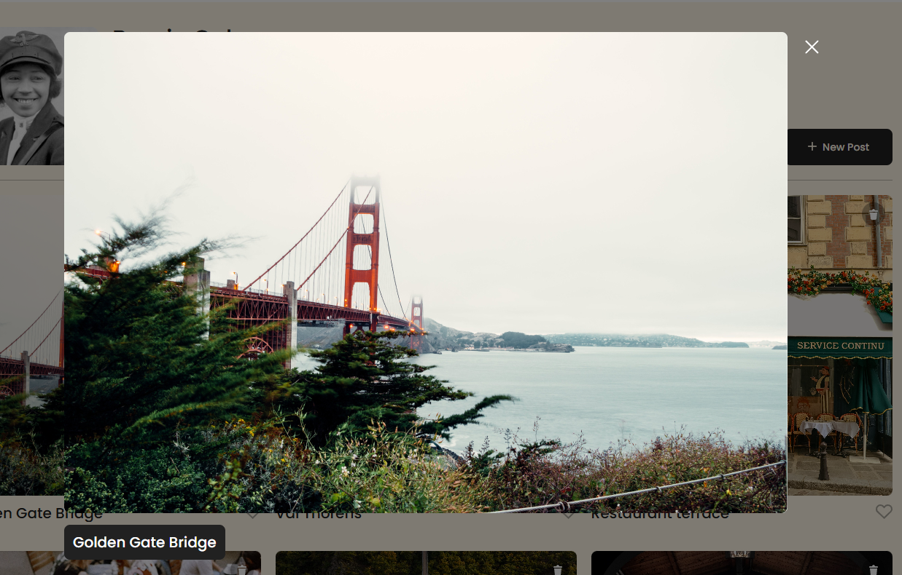

# Spots: Responsive Landing Page

A modern, responsive landing page project built as part of the TripleTen curriculum.

## Table of Contents

- [Overview](#overview)
- [Features](#features)
- [Screenshots](#screenshots)
- [Getting Started](#getting-started)
- [Project Structure](#project-structure)
- [Technologies Used](#technologies-used)
- [Contributing](#contributing)
- [License](#license)
- [Links](#links)

## Overview

**Spots** is a responsive web application that displays a user profile and a gallery of interactive post cards. The interface adapts seamlessly to desktop, tablet, and mobile devices, ensuring a consistent user experience. The project emphasizes semantic HTML, modular CSS (BEM), accessibility, and interactive JavaScript.

## Features

- Responsive layout using CSS Grid and Flexbox
- User profile section with avatar, name, description, and action buttons
- Dynamic post cards rendered from JavaScript data
- Interactive popups for editing profile and adding new posts
- Form validation and accessibility best practices
- Custom fonts and icon integration
- Cross-browser compatibility with Normalize.css

## Screenshots

| Desktop                                               | Tablet                                              | Mobile                                              |
| ----------------------------------------------------- | --------------------------------------------------- | --------------------------------------------------- |
|  |  |  |

| Edit Profile                                                    | New Posts                                               | Preview Posts                                                    |
| --------------------------------------------------------------- | ------------------------------------------------------- | ---------------------------------------------------------------- |
|  |  |  |

## Getting Started

To view the project locally:

1. **Clone the repository:**

```bash
git clone https://github.com/itsjaydenking/se_project_spots.git
cd se_project_spots
```

2. **Open `index.html` in your browser.**

No build tools or dependencies are required.

## Project Structure

```
blocks/    # BEM CSS blocks (header, profile, cards, etc.)
images/    # Image assets and icons
pages/     # Page-level CSS
scripts/   # JavaScript for interactivity
vendor/    # Third-party CSS (Normalize.css, fonts)
index.html # Main HTML file
README.md  # Project documentation
```

## Technologies Used

- HTML5
- CSS3 (Grid, Flexbox)
- JavaScript (ES6+)
- [Normalize.css](vendor/normalize.css)
- [Poppins Font](vendor/fonts.css)

## Contributing

Contributions are welcome! Please open an issue or submit a pull request for improvements or bug fixes.

## License

Fonts are licensed under the SIL Open Font License. See [`vendor/fonts/Poppins/OFL.txt`](vendor/fonts/Poppins/OFL.txt) for details.

## Links

- [Live Demo (GitHub Pages)](https://itsjaydenking.github.io/se_project_spots/)
- [Video Review](https://drive.google.com/file/d/1rdJ3PKwnR3Se2SI9gV-TCxhHTKQpz3x-/view?usp=sharing)
