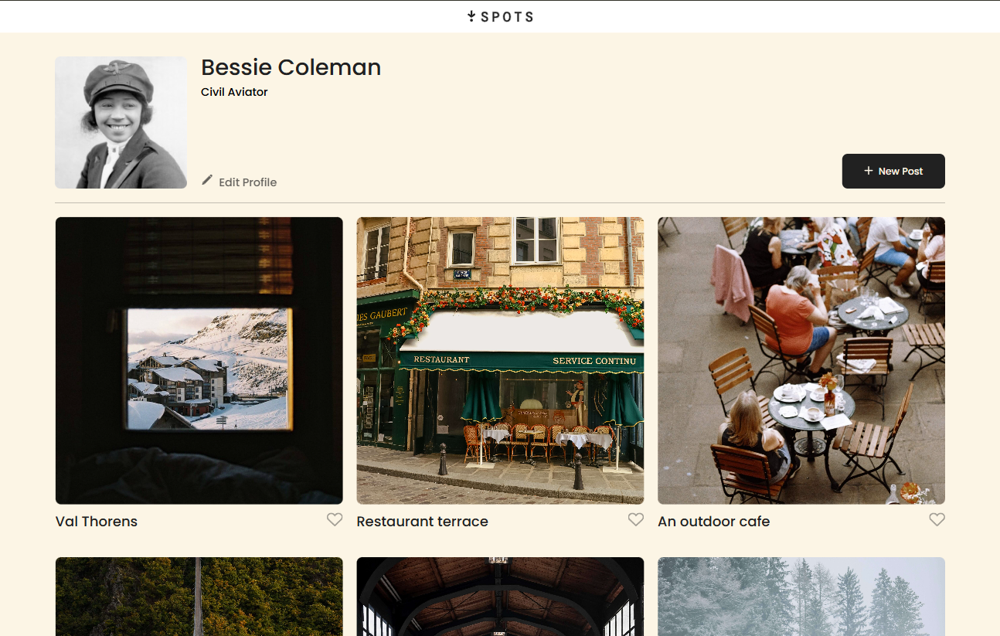
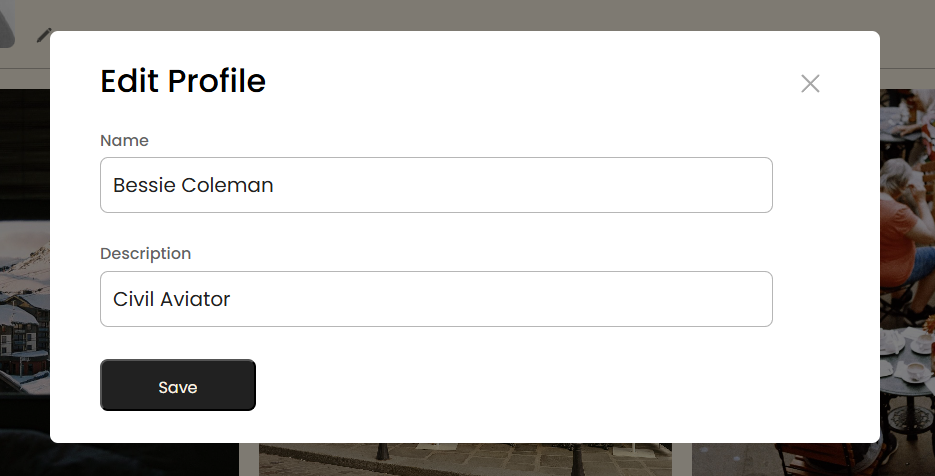
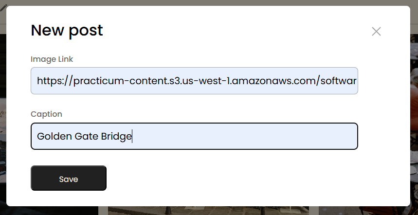
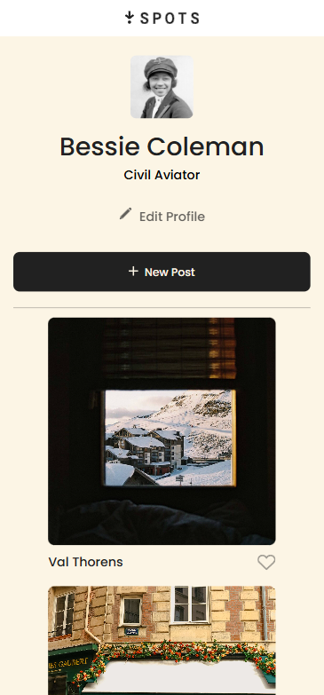
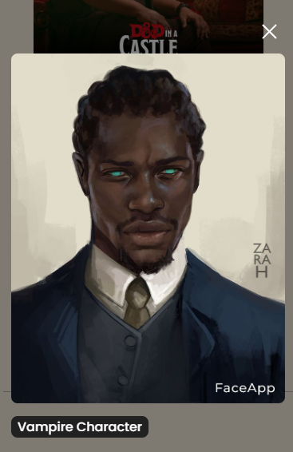
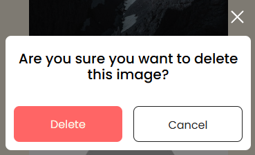

# 🌟 Spots: Interactive Social Media Platform

> A full-stack social media application with real-time interactions, built with modern web technologies and best practices.

[](https://itsjaydenking.github.io/se_project_spots/)
[]()
[](https://github.com/itsjaydenking/se_project_spots)

## 📋 Table of Contents

- [🎯 Project Overview](#-project-overview)
- [✨ Key Features](#-key-features)
- [🛠️ Technical Stack](#️-technical-stack)
- [🏗️ Architecture & Design Patterns](#️-architecture--design-patterns)
- [📱 Responsive Design](#-responsive-design)
- [🚀 Getting Started](#-getting-started)
- [📸 Screenshots & Demo](#-screenshots--demo)
- [🔧 Development Highlights](#-development-highlights)
- [🌐 API Integration](#-api-integration)
- [♿ Accessibility & UX](#-accessibility--ux)
- [📊 Performance & Optimization](#-performance--optimization)
- [🎨 Design System](#-design-system)
- [📁 Project Structure](#-project-structure)
- [🔮 Future Enhancements](#-future-enhancements)
- [👨‍💻 About the Developer](#-about-the-developer)

## 🎯 Project Overview

**Spots** is a modern, Instagram-inspired social media platform that demonstrates advanced front-end development skills. Users can create profiles, share images, interact with posts through likes, and manage their content in real-time. The application emphasizes clean code architecture, responsive design, and seamless user experience.

### 🎪 What Makes This Special?

- **Real-time API Integration**: Full CRUD operations with persistent data
- **Modern ES6+ JavaScript**: Clean, modular, and maintainable code architecture
- **Responsive Design**: Pixel-perfect across all devices (mobile-first approach)
- **Advanced Form Validation**: Real-time validation with custom error handling
- **Interactive UI/UX**: Smooth animations, loading states, and intuitive interactions
- **Accessibility First**: WCAG compliant with semantic HTML and ARIA attributes

## ✨ Key Features

### 🔐 User Management

- **Profile Editing**: Update name, bio, and avatar with real-time validation
- **Avatar Upload**: Dynamic profile picture updates with instant preview
- **User Authentication**: Secure API token-based authentication

### 📸 Content Management

- **Post Creation**: Add new posts with image URLs and captions
- **Post Deletion**: Remove posts with confirmation modal for safety
- **Image Preview**: Full-screen image viewing with elegant modal overlay
- **Dynamic Loading**: Smooth loading states for all user interactions

### ❤️ Social Interactions

- **Like System**: Toggle likes with instant visual feedback
- **Persistent State**: Like states maintained across page refreshes
- **Real-time Updates**: All interactions sync with backend immediately

### 🎨 User Experience

- **Modal System**: Elegant popups for all user interactions
- **Form Validation**: Real-time validation with custom error messages
- **Loading States**: Professional loading indicators for all API calls
- **Error Handling**: Graceful error handling with user-friendly messages

## 🛠️ Technical Stack

### Frontend Technologies

- **HTML5**: Semantic markup with accessibility best practices
- **CSS3**: Advanced Grid/Flexbox layouts with custom properties
- **JavaScript ES6+**: Modern syntax with modules, async/await, and classes
- **Webpack**: Module bundling with optimized development workflow

### Development Tools

- **BEM Methodology**: Scalable CSS architecture
- **Git**: Version control with conventional commits
- **ESLint**: Code quality and consistency
- **Prettier**: Automated code formatting

### API & Backend

- **RESTful API**: Full integration with TripleTen's backend service
- **Fetch API**: Modern HTTP client with error handling
- **JSON**: Data exchange format with proper serialization

## 🏗️ Architecture & Design Patterns

### 🧩 Modular Architecture

```
src/
├── blocks/          # BEM CSS components
├── pages/           # Page-level JavaScript and styles
├── scripts/         # Reusable JavaScript modules
├── utils/           # Utility functions and API client
├── images/          # Optimized assets
└── vendor/          # Third-party dependencies
```

### 🎯 Design Patterns Used

- **Module Pattern**: Clean separation of concerns
- **Observer Pattern**: Event-driven architecture
- **Factory Pattern**: Dynamic DOM element creation
- **Singleton Pattern**: API client configuration
- **Command Pattern**: Form submission handling

### 🔄 State Management

- **Centralized State**: Global application state management
- **Immutable Updates**: Predictable state changes
- **Event-Driven Updates**: Reactive UI updates

## 📱 Responsive Design

### 🎯 Breakpoints Strategy

- **Desktop**: 1280px+ (Primary design target)
- **Tablet**: 768px - 1279px (Adaptive layouts)
- **Mobile**: 320px - 767px (Mobile-first approach)

### 📐 Layout Techniques

- **CSS Grid**: Advanced grid layouts for card galleries
- **Flexbox**: Component-level layouts and alignments
- **Fluid Typography**: Responsive font scaling
- **Flexible Images**: Responsive images with proper aspect ratios

## 🚀 Getting Started

### 📋 Prerequisites

- Modern web browser (Chrome, Firefox, Safari, Edge)
- Git for version control
- Code editor (VS Code recommended)

### ⚡ Quick Start

```bash
# Clone the repository
git clone https://github.com/itsjaydenking/se_project_spots.git

# Navigate to project directory
cd se_project_spots

# Open in VS Code (optional)
code .

# Start development server (if using Live Server extension)
# Or simply open index.html in your browser
```

### 🛠️ Development Setup

```bash
# Install dependencies (if using npm setup)
npm install

# Start development server
npm run dev

# Build for production
npm run build
```

## 📸 Screenshots & Demo

### 🖥️ Desktop Experience

| Home Page                                             | Profile Editing                                            | Post Creation                                      |
| ----------------------------------------------------- | ---------------------------------------------------------- | -------------------------------------------------- |
|  |  |  |

### 📱 Mobile Experience

| Mobile Home                                         | Image Preview                                                       | Delete Confirmation                                        |
| --------------------------------------------------- | ------------------------------------------------------------------- | ---------------------------------------------------------- |
|  |  |  |

### 🎥 Interactive Demo

[]()

## 🔧 Development Highlights

### 🎨 Code Quality Features

- **ESLint Configuration**: Enforces code consistency and best practices
- **Modular CSS**: BEM methodology for scalable stylesheets
- **Semantic HTML**: Accessible markup with proper ARIA labels
- **Error Boundaries**: Graceful error handling and user feedback

### ⚡ Performance Optimizations

- **Lazy Loading**: Efficient image loading strategies
- **Code Splitting**: Modular JavaScript for faster load times
- **CSS Optimization**: Minimal and efficient stylesheets
- **Asset Optimization**: Compressed images and fonts

### 🔒 Security Best Practices

- **Input Sanitization**: Protection against XSS attacks
- **API Security**: Secure token-based authentication
- **Form Validation**: Client-side and server-side validation
- **HTTPS**: Secure data transmission

## 🌐 API Integration

### 🔗 Endpoints Used

```javascript
// User Management
GET / users / me; // Get user profile
PATCH / users / me; // Update profile
PATCH / users / me / avatar; // Update avatar

// Content Management
GET / cards; // Fetch all posts
POST / cards; // Create new post
DELETE / cards / { id }; // Delete post

// Social Features
PUT / cards / { id } / likes; // Like post
DELETE / cards / { id } / likes; // Unlike post
```

### 🚀 API Client Architecture

```javascript
class Api {
  // Centralized HTTP client
  // Error handling and response parsing
  // Token-based authentication
  // Request/response interceptors
}
```

## ♿ Accessibility & UX

### 🎯 Accessibility Features

- **WCAG 2.1 Compliance**: AA-level accessibility standards
- **Keyboard Navigation**: Full keyboard accessibility
- **Screen Reader Support**: Proper ARIA labels and descriptions
- **Color Contrast**: Meets accessibility contrast requirements
- **Focus Management**: Logical focus flow and visual indicators

### 🎨 UX Design Principles

- **Progressive Enhancement**: Works without JavaScript
- **Mobile-First**: Optimized for mobile experiences
- **Loading States**: Clear feedback for all user actions
- **Error Handling**: User-friendly error messages
- **Intuitive Navigation**: Clear information architecture

## 📊 Performance & Optimization

### ⚡ Core Web Vitals

- **LCP**: < 2.5s (Largest Contentful Paint)
- **FID**: < 100ms (First Input Delay)
- **CLS**: < 0.1 (Cumulative Layout Shift)

### 🚀 Optimization Techniques

- **Image Optimization**: WebP format with fallbacks
- **CSS Minification**: Compressed stylesheets
- **JavaScript Bundling**: Optimized module loading
- **Caching Strategy**: Browser caching for static assets

## 🎨 Design System

### 🎨 Color Palette

```css
:root {
  --primary-bg: #fcf5e5; /* Warm cream background */
  --primary-text: #212121; /* Dark charcoal text */
  --accent-color: #ff6565; /* Error/delete actions */
  --success-color: #4caf50; /* Success states */
  --border-color: #21212154; /* Subtle borders */
}
```

### 📝 Typography Scale

- **Headlines**: Poppins 32px/500 weight
- **Body Text**: Poppins 16px/400 weight
- **Captions**: Poppins 14px/400 weight
- **Labels**: Poppins 16px/500 weight

### 🔲 Component Library

- **Buttons**: Primary, secondary, and danger variants
- **Forms**: Input fields with validation states
- **Cards**: Post cards with interaction states
- **Modals**: Overlay system with backdrop blur

## 📁 Project Structure

```
se_project_spots/
├── 📂 src/
│   ├── 📂 blocks/           # BEM CSS components
│   │   ├── card.css         # Post card styles
│   │   ├── modal.css        # Modal system styles
│   │   ├── profile.css      # Profile section styles
│   │   └── ...
│   ├── 📂 pages/            # Page-level files
│   │   ├── index.css        # Main stylesheet imports
│   │   └── index.js         # Main JavaScript entry
│   ├── 📂 scripts/          # JavaScript modules
│   │   └── validation.js    # Form validation logic
│   ├── 📂 utils/            # Utility functions
│   │   ├── Api.js           # API client class
│   │   └── utils.js         # Helper functions
│   ├── 📂 images/           # Image assets
│   ├── 📂 vendor/           # Third-party code
│   └── index.html           # Main HTML file
├── 📄 webpack.config.js     # Build configuration
├── 📄 package.json          # Dependencies and scripts
└── 📄 README.md             # This file
```

## 🔮 Future Enhancements

### 🚀 Planned Features

- [ ] **User Authentication**: Login/signup system
- [ ] **Image Upload**: Direct file upload capability
- [ ] **Comments System**: Post comments and replies
- [ ] **Real-time Updates**: WebSocket integration
- [ ] **Push Notifications**: Browser notification API
- [ ] **Dark Mode**: Theme switching capability
- [ ] **Search Functionality**: Content and user search
- [ ] **Infinite Scroll**: Paginated content loading

### 🛠️ Technical Improvements

- [ ] **TypeScript Migration**: Type safety and better DX
- [ ] **PWA Features**: Offline functionality and app install
- [ ] **Performance Monitoring**: Real user monitoring setup
- [ ] **E2E Testing**: Cypress test automation
- [ ] **CI/CD Pipeline**: Automated deployment workflow

## 👨‍💻 About the Developer

**Jordan Campbell** - Full Stack Developer passionate about creating engaging web experiences with clean, maintainable code.

### 🎯 Skills Demonstrated

- **Frontend Development**: HTML5, CSS3, JavaScript ES6+
- **API Integration**: RESTful services and async programming
- **Responsive Design**: Mobile-first development approach
- **Code Architecture**: Modular, scalable code organization
- **UX/UI Design**: User-centered design principles
- **Performance**: Web vitals optimization and best practices

### 🌐 Connect with Me

- **Portfolio**: [Jordan Campbell Dev](https://github.com/itsjaydenking/itsjaydenking)
- **LinkedIn**: [Jordan Campbell LinkedIn](https://www.linkedin.com/in/campbell-jordan-c/)
- **GitHub**: [Jordan Campbell Github](https://github.com/itsjaydenking)
- **Email**: [campbelljordan64@gmail.com](mailto:campbelljordan64@gmail.com)

---

### 📜 License & Acknowledgments

This project was built as part of the **TripleTen Software Engineering Program**.

**Fonts**: Poppins font family licensed under [SIL Open Font License](src/vendor/fonts/Poppins/OFL.txt)

**Created with ❤️ by Jordan Campbell** | © 2025

---

⭐ **Star this repository if you found it helpful!** ⭐
